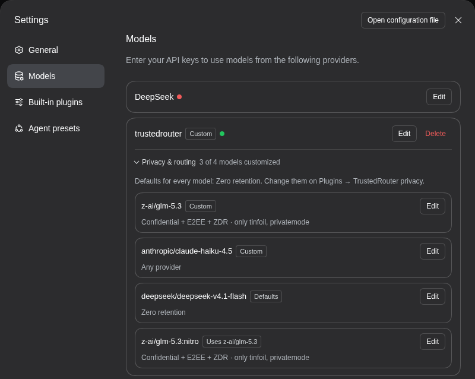
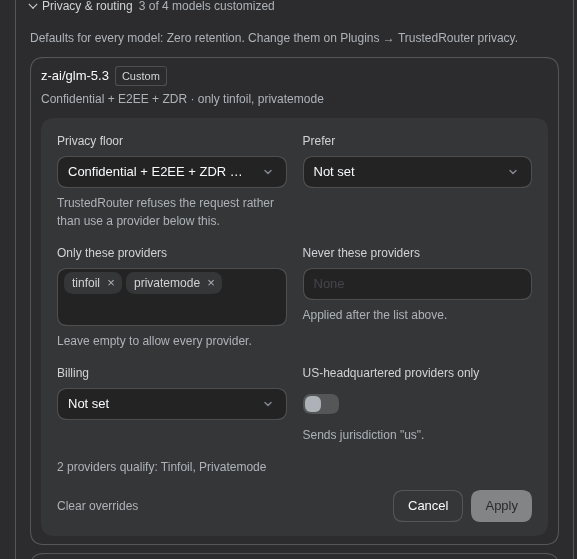
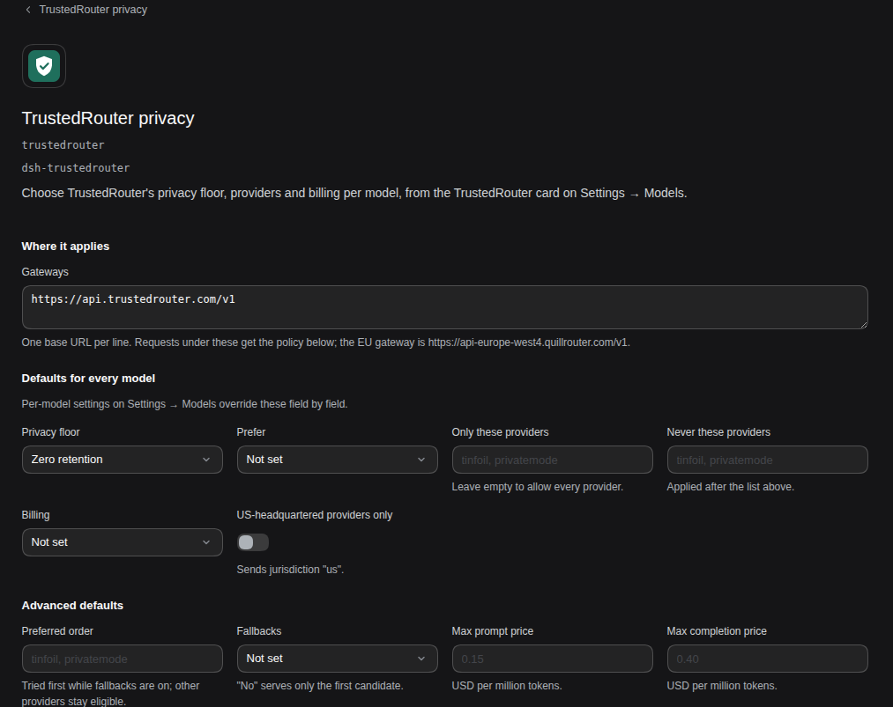

# dsh-trustedrouter

Per-model [TrustedRouter](https://trustedrouter.com) privacy and routing settings for [DeepSeek Harness](https://github.com/deepseek-ai/deepseek-harness) (dsh).

For each model, choose a privacy floor, which providers may serve it, what to optimize for, how it's billed and whether providers must be US-based. You do this from **Settings → Models** in the dsh web UI. The plugin adds your choices to every request as TrustedRouter's [`provider` object](https://trustedrouter.com/docs/provider-routing).



## Why a plugin

TrustedRouter reads routing and privacy policy only from the request body, for example `{"provider": {"min_privacy": "confidential"}}`. No header or API-key setting does the same job. dsh's model providers can add headers but not body fields, so without this plugin there's no way to ask for a privacy floor.

## Requirements

- **dsh web**, tested on 0.2.0-rc.2 and 0.2.1-alpha.1 (see [Tested with](#tested-with)). The desktop app isn't supported.
- **pnpm on your PATH.** dsh installs plugins with it, and fails with "pnpm was not found" otherwise. If you don't have it, run `corepack enable pnpm` or `npm install -g pnpm`.
- **A TrustedRouter provider in dsh.** Settings → Models → **Add model provider** → **Custom model API**:
  - base URL `https://api.trustedrouter.com/v1`;
  - API protocol **OpenAI Chat Completions**;
  - your TrustedRouter API key;
  - the models you want, e.g. `z-ai/glm-5.3`.

## Install

**From the dsh web UI:**

1. Sidebar → **Plugins** → **Add plugin**.
2. Enter `https://github.com/AmmarByFar/dsh-trustedrouter#v0.1.0` and choose **Install**.
3. Choose **Enable now**. No reload or restart is needed.

**From the command line**, for the `web` profile that `dsh web` uses:

```sh
dsh plugin --profile web add github:AmmarByFar/dsh-trustedrouter#v0.1.0
```

Then restart `dsh web` if it was running.

The plugin has no build step, so pnpm doesn't ask you to allow one. Its only peer dependency, `@deepseek-ai/schemastery`, comes from dsh itself, so the peer warning pnpm prints is expected.

**Installing changes nothing yet.** Requests go out unchanged until you set a policy.

**Upgrading.** dsh doesn't update installed plugins yet. Uninstall the plugin (Plugins → TrustedRouter privacy → **Uninstall**), then install the new tag. Your settings live in your profile, not in the plugin, so they're kept.

## Use

### Per model: Settings → Models

Open **Settings → Models**, find your TrustedRouter card and open **Privacy & routing**.

Each of the provider's models is listed with the policy it gets. Its tag says where that policy comes from:
- **Custom** for the model's own settings;
- **Defaults** when it only has the defaults;
- **Uses \<model\>** for a variant such as `z-ai/glm-5.3:nitro`, which follows its base model unless you give it settings of its own.

**Edit** opens a model's settings:



| Setting | Sends | Notes |
|---|---|---|
| Privacy floor | `min_privacy`: `no_store`, `zdr` or `confidential` | Each level lists the providers that meet it for this model. TrustedRouter refuses the request rather than use a provider below the floor. |
| Prefer | `sort`: `price`, `latency` or `throughput` | |
| Only these providers | `only` | Empty allows every provider. |
| Never these providers | `ignore` | |
| Billing | `usage`: `credits` or `byok` | TrustedRouter credits, or your own provider key (BYOK). |
| US-headquartered providers only | `jurisdiction: "us"` | |

As you change settings, the editor counts the providers that still qualify. It warns you if none do, because TrustedRouter would then refuse every request for that model.

**Apply** saves to your profile, and the next request uses it. No restart is needed.

A few things to know:
- The section appears only on saved providers whose base URL is under a configured gateway. By default that's `https://api.trustedrouter.com/v1`.
- You can only change settings from a browser on the same machine as dsh. That's a dsh rule for all settings.
- To list providers per model, your browser fetches TrustedRouter's public model list (`<base URL>/models`, no API key sent) the first time you open the section. If that fails, every privacy level is offered.

### Defaults and advanced settings: the Plugins page

Sidebar → **Plugins** → **TrustedRouter privacy** (under Installed), then the **TrustedRouter privacy** row under Components.



- **Gateways:** the base URLs the policy applies to, one per line. Add the EU gateway, `https://api-europe-west4.quillrouter.com/v1`, if you use it.
- **Defaults for every model:** the same settings as a model has. A model's own settings override them field by field.
- **Advanced defaults:**
  - preferred provider order (`order`);
  - whether to fall back to other providers (`allow_fallbacks`);
  - maximum prompt and completion prices in USD per million tokens (`max_price`).
- **Per-model overrides (JSON):** every model's settings, including any `provider` field the Models page doesn't show.
- **Raw body rules (JSON):** fields deep-merged into every POST under a base URL, for anything that isn't `provider`.
- **Log changes to the terminal:** see [Check that it works](#check-that-it-works).

### Config file

Both pages write the `trustedrouter` row in your profile's `cordis.patch.yml`. For `dsh web` that's `~/.dsh/profiles/web/cordis.patch.yml`, or under `$DSH_HOME` if you set it. You can also edit it by hand:

```yaml
- id: trustedrouter
  config:
    gateways: [https://api.trustedrouter.com/v1]   # the default
    defaults: { min_privacy: zdr }                 # for every model on those gateways
    models:                                        # keyed by model id
      z-ai/glm-5.3: { min_privacy: confidential, only: [tinfoil, privatemode] }
    rules: []                                      # optional [{ baseURL, body }], deep-merged after the policy
    log: false
```

How a request's `provider` is built:
- A model's settings are its entry in `models`, merged over `defaults`. A `:suffix` id such as `z-ai/glm-5.3:nitro` uses its base model's entry unless it has its own.
- The result is merged over any `provider` the request already has, so your policy wins. Lists replace rather than combine.
- Values are type-checked, so a misspelled privacy level or a malformed URL is rejected. Fields the plugin doesn't know are passed through; TrustedRouter rejects unknown options with a 400, so a typo fails loudly rather than being ignored.

## Check that it works

1. Turn on **Log changes to the terminal** (or set `log: true`).
2. Send a chat with a TrustedRouter model. The terminal running `dsh web` prints a line like this:
   ```
   [trustedrouter] added provider to POST https://api.trustedrouter.com/v1/chat/completions for z-ai/glm-5.3: {"min_privacy":"confidential"}
   ```
3. Optionally, prove the floor is enforced. Set **Confidential** on a model no confidential provider serves, such as `anthropic/claude-haiku-4.5`. The chat should fail with TrustedRouter's 400: `No route candidates match the requested provider filters`.

Repeat step 2 after every dsh upgrade (see [Limitations](#how-it-works-and-limitations)). The log never includes request bodies, only the URL, the model id and the fields added.

## How it works and limitations

- **It wraps the dsh server's `fetch`.** POSTs under a gateway get `provider` merged into their JSON body. GETs, such as model discovery, and requests to other URLs pass through untouched. A request whose model has no policy is sent byte for byte.
- **It fails closed.** If a POST to a gateway needs a policy but its body can't be read, the plugin refuses it rather than send it without the policy. The refusal is always printed to the terminal.
- **It relies on dsh internals.** It works because dsh's model clients use the global `fetch`. If a dsh release changes that, requests would go out without your policy, and nothing would error. Check the log line after upgrading dsh. This repo's CI also runs weekly against dsh's latest and alpha releases to catch it.
- **Settings are per model, not per chat.**
- **Web only:** `dsh web` in a browser, not the desktop app.

## Tested with

| dsh | Node |
|---|---|
| 0.2.0-rc.2 (npm `latest`) | 22 |
| 0.2.1-alpha.1 (npm `alpha`) | 22 |

dsh is pre-release, so newer versions may move the settings pages this plugin hooks into.

## Development

```sh
npm install                    # the schemastery devDependency, for tests
npm test                       # unit tests, host and client
test/e2e/run-all.sh            # headless dsh against a mock gateway; DSH_VERSION=0.2.0-rc.2|alpha|latest
test/e2e/clean-install.sh      # install the packed plugin into a fresh dsh home and check both halves
test/ui/scratch-web.sh start <dir>   # a scratch dsh web with this checkout linked in, for the browser
```

There's no build step: `index.js` (the server half) and `client.js` (the browser half) are what ships. [PLAN.md](PLAN.md) has the design notes and the dsh internals they depend on.

## License

[MIT](LICENSE)
